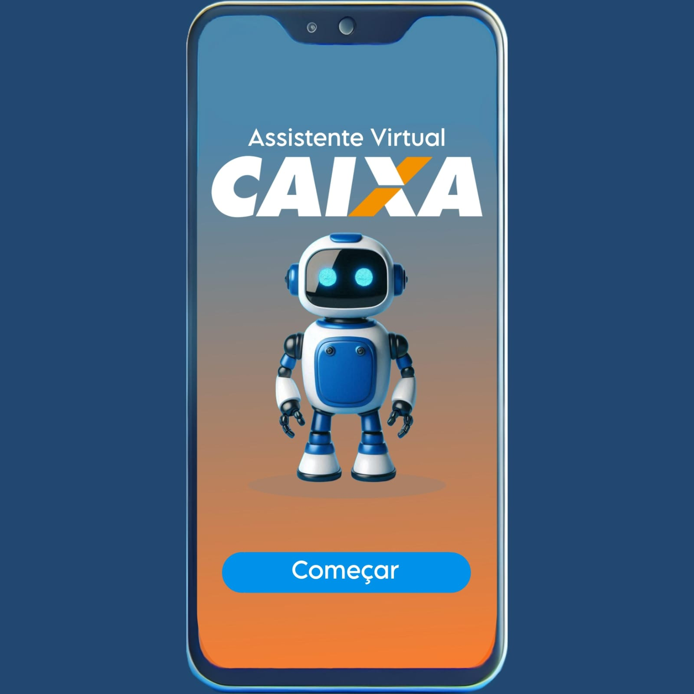

# Assistente Virtual Benefícios Sociais CAIXA: Revolucionando a Experiência dos Beneficiários

Uma Nova Era no Atendimento Social

 

> ℹ️ **NOTE:** Este é o repositório desenvolvido durante o Desafio CAIXA - Criando Impacto Social com IA da CAIXA

# Projeto Assistente Virtual Benefícios Sociais CAIXA

Projeto inovador que promete transformar radicalmente a maneira de como os beneficiários interagem com seus benefícios sociais.

**💻 Introdução**

O Assistente Virtual Benefícios Sociais CAIXA é uma iniciativa revolucionária voltada para melhorar a comunicação entre os beneficiários dos programas sociais federais, estaduais e municipais e os serviços oferecidos. Com foco inicial no Programa Bolsa Família, o projeto foi concebido para expandir suas funcionalidades e abranger outros benefícios sociais no futuro.

**🤖 Potencial Transformador**

O Assistente Virtual Benefícios Sociais CAIXA tem o potencial de transformar significativamente a interação entre os beneficiários e os programas sociais. Seus principais impactos incluem:

- **Respostas ágeis e precisas em tempo real:** Melhorando a experiência do usuário.
- **Redução da sobrecarga nos canais de atendimento tradicionais:** Aliviando a demanda nos atendimentos físicos e telefônicos.
- **Inclusão digital e modernização dos serviços públicos:** Tornando os serviços sociais mais acessíveis a todos os beneficiários.

**🚀 Conclusão**

Este projeto representa um avanço significativo na transformação digital CAIXA e no atendimento social no Brasil. Com uma abordagem inovadora e com o uso de tecnologias avançadas, o assistente virtual redefinirá a experiência dos beneficiários, tornando os serviços sociais mais acessíveis, eficientes e modernos. Este é apenas o começo de uma jornada de transformação que promete trazer mudanças significativas para milhões de brasileiros.

**📚 Materiais**

- ChatGPT(https://chat.openai.com/)
- Copilot Studio (https://www.microsoft.com/pt-br/microsoft-copilot/microsoft-copilot-studio)
- Agente chatbot criado preliminarmente no Copilot Studio (https://m365.cloud.microsoft/apps/?templatedAppId=9e2962b8-7eae-4124-86f3-1799090725e1&templateInstanceId=cf6c0ed7-68df-412d-8a07-592cfcf9c816&environment=Default-ab9bba98-684a-43fb-add8-9c2bebede229&source=embedded-builder)

**✨ Resultado do Trabalho**

<a href=https://github.com/KelenFTV/Desafio-CAIXA-Criando-Impacto-Social-com-IA/blob/main/Apresenta%C3%A7%C3%A3o_Projeto_finall.pdf now"> 📕Clique aqui para ver  o ROADMAP</a>

👨‍💻 **# Expert**

    
    
Kelen Vazquez 
    <a href=https://github.com/KelenFTV>GitHub</a> | <a href=www.linkedin.com/in/kelen-vazquez-6>LinkedIn</a> | <a href=https://www.instagram.com/kelen.ferreira9/>Instagram</a>

---

⌨️ com 💜 por [Kelen Vazquez](https://github.com/KelenFTV)

